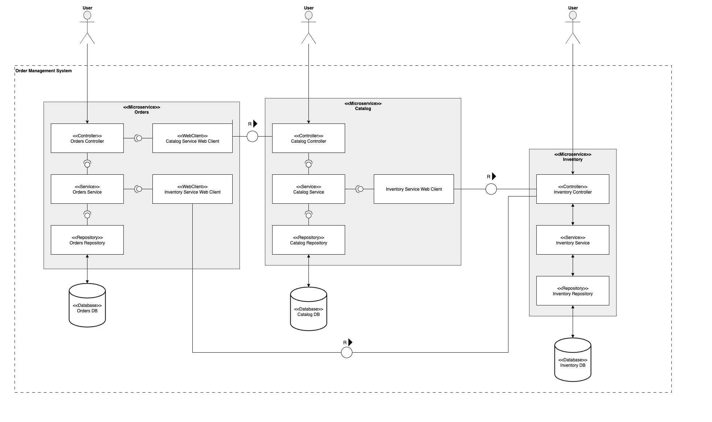
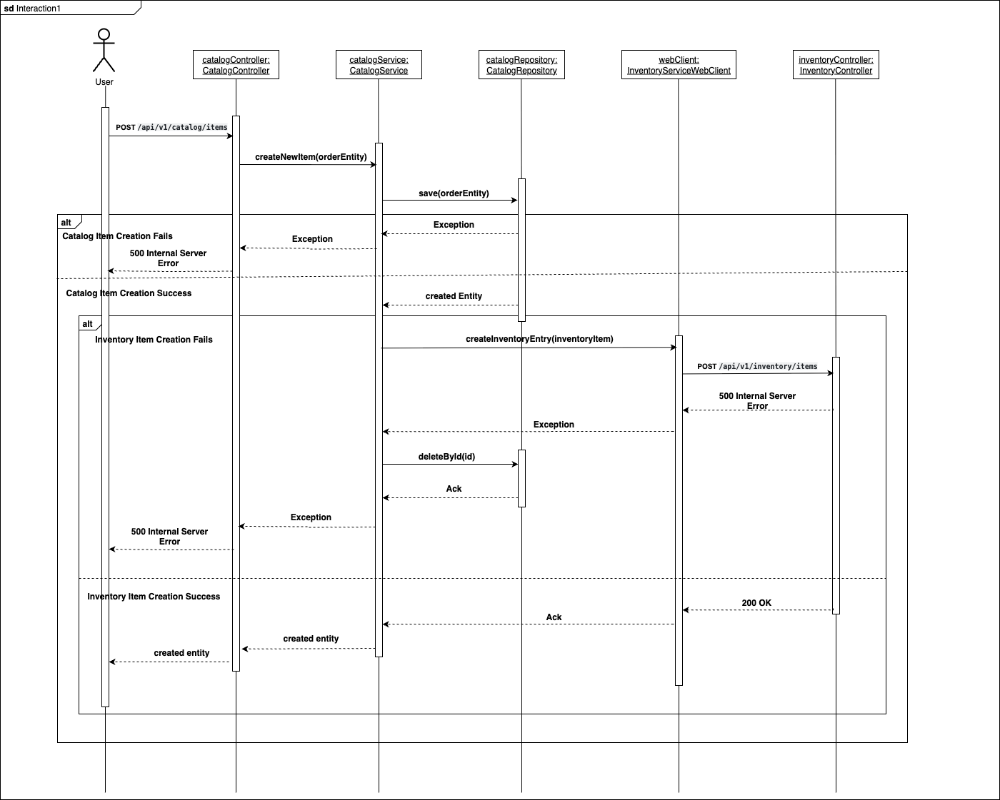
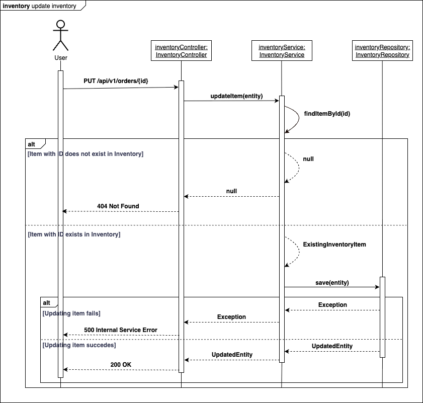

# Order Management System

## Overview

The **Order Management System** is a modular Spring Boot application designed for e-commerce platforms to manage the product catalog, inventory, and order lifecycle. It allows users to browse products, check stock availability, and place orders while ensuring real-time validation of product details and stock. The system is structured into three independent modules that communicate with each other using **WebClients**.

The modules are as follows:
- **Catalog Module**: Provides product details including cost and availability, by interacting with the Inventory module for real-time stock data.  
- **Inventory Module**: Maintains product stock levels for products listed in the catalog.  
- **Orders Module**: Manages the lifecycle of orders, validates stock with the Inventory module, retrieves pricing from the Catalog module, and calculates the total order value.  



## Basic Interactions
The Order Management System (OMS) currently supports three core types of user interactions:

1. Catalog Management – Users can create new catalog items.
2. Inventory Management – Users can update and maintain inventory levels to ensure accurate stock availability.
3. Order Processing – Users can place orders through the system.

At this stage, the system does not differentiate between user roles or personas. The term user refers broadly to any individual or external system that interacts with the OMS.

#### 1. Creating a new catalog item

To create a new catalog item, the user sends a POST request to the catalog service at the endpoint `/api/v1/catalog/items`, with a payload such as ```{ "name": "Laptop", "pricePerUnit": 1200.0, "category": "Electronics" }```.

The Catalog Controller receives the request, converts the DTO into an Entity, and forwards it to the service layer for processing. The service then delegates the request to the repository to persist the entity.

- If entity creation fails, the system returns a 500 Internal Server Error response to the user.
- If entity creation succeeds, the service uses the InventoryServiceWebClient to send a POST request to the inventory module, creating a corresponding inventory item with the same item ID as the catalog item.

If the inventory item creation fails, the web client raises an exception, prompting the service to roll back the catalog item creation in the repository to ensure data consistency.

If the inventory item creation succeeds, the catalog service receives an acknowledgment from the web client, propagates the created catalog item back to the controller, and returns a 201 Created response to the user.




#### 2. Updating inventory stock levels

When a new item is created in the catalog, a corresponding entry with the same ID is automatically created in the inventory. By default, the stock level is initialized to 0. The stock levels need to be updated manually to match the actual stock units. To reflect actual stock quantities, the stock level must be updated manually. This can be done using a PUT request to the following endpoint: `api/v1/inventory/items/{id}` with a payload, for example ```{"id": 1, "quantity":"10"}```. If the item does not exist, then a 404 response is sent back to the user. If the item exists, then an update is attempted. 

- If the update fails, a 500 error response is sent back to the user.
- If the update is successful, then a 200 response is sent back to the user.




#### 3. Creating a new order

The user can place the new order by sending a POST request to `/api/v1/orders` with a payload as ```{ "itemId": 1, "quantity": 2, "status": "new", "contact": "test@example.com" }```. The `OrdesController` makes use of the `CatalogServiceWebClient` to fetch the catalog item included in the order.

- If the catalog does not contain the item, an exception is returned, and the user is responded with a 500 Internal Server Error.
- If the catalog contains the item, the item is returned to the controller, which uses the item to fetch the price per unit and calculate the total cost.

The controller then forwards the entity to the service. The service makes use of the InventoryServiceWebClient to fetch the inventory item corresponding to the order.

- If the inventory does not contain the item, an exception is returned, and the user is responded with a 500 Internal Server Error.
- If the inventory contains the item, then the item is returned to the service, which uses the item to check if the order quantity is <= to the stock available.


## API Specifications For Each Microservice

#### Orders API

| HTTP Method | Endpoint | Description | Request Body | Query Params | Path Params | Responses |
|-------------|----------|-------------|--------------|--------------|-------------|-----------|
| **POST** | `/api/v1/orders` | Create a new order | ``` { "itemId": 1, "quantity": 2, "status": "new", "contact": "test@example.com" }``` | – | – | **201 Created** – Returns created order`.<br>**500 Internal Server Error** – If creation fails. |
| **GET** | `/api/v1/orders` | Fetch all orders | – | – | – | **200 OK** – Returns list of orders.<br>**500 Internal Server Error** – If retrieval fails. |
| **GET** | `/api/v1/orders/{id}` | Fetch order by ID | – | – | `id` (integer) | **200 OK** – Returns found order.<br>**404 Not Found** – If order does not exist.<br>**500 Internal Server Error** – If retrieval fails. |
| **PUT** | `/api/v1/orders/{id}` | Update an existing order by ID | ```{ "itemId": 1, "quantity": 2, "status": "processing", "contact": "test@example.com" }``` | – | `id` (integer) | **200 OK** – Returns updated order.<br>**404 Not Found** – If order does not exist.<br>**500 Internal Server Error** – If update fails. |
| **DELETE** | `/api/v1/orders/{id}` | Delete an order by ID | – | – | `id` (integer) | **200 OK** – Successfully deleted.<br>**404 Not Found** – If order does not exist.<br>**500 Internal Server Error** – If deletion fails. |
| **GET** | `/api/v1/orders?status={status}` | Fetch all orders by status | – | `status` (string) | – | **200 OK** – Returns List of orders with that status.<br>**500 Internal Server Error** – If retrieval fails. |

#### Inventory API (v1)

| HTTP Method | Endpoint | Description | Request Body | Query Params | Path Params | Responses |
|-------------|----------|-------------|--------------|--------------|-------------|-----------|
| **GET** | `/api/v1/inventory/items` | Fetch all inventory items | – | – | – | **200 OK** – Returns list of inventory items.<br>**500 Internal Server Error** – If retrieval fails. |
| **POST** | `/api/v1/inventory/items` | Add a new inventory item | ``` { "id": 1, "quantity": 100 }``` | – | – | **201 Created** – Returns created Inventory item.<br>**409 Conflict** – If item with given ID already exists.<br>**500 Internal Server Error** – If creation fails. |
| **GET** | `/api/v1/inventory/items/{id}` | Fetch single inventory item by ID | – | – | `id` (integer) | **200 OK** – Returns the found inventory item.<br>**404 Not Found** – If item does not exist.<br>**500 Internal Server Error** – If retrieval fails. |
| **DELETE** | `/api/v1/inventory/items/item?id={id}` | Delete inventory item by ID | – | `id` (integer) | – | **200 OK** – Successfully deleted.<br>**404 Not Found** – If item does not exist.<br>**500 Internal Server Error** – If deletion fails. |
| **PATCH** | `/api/v1/inventory/items` | Update an inventory item | ``` { "id": 1, "quantity": 150 }``` | – | – | **200 OK** – Successfully updated.<br>**404 Not Found** – If item does not exist.<br>**500 Internal Server Error** – If update fails. |

#### Catalog API (v1)

| HTTP Method | Endpoint | Description | Request Body | Query Params | Path Params | Responses |
|-------------|----------|-------------|--------------|--------------|-------------|-----------|
| **GET** | `/api/v1/catalog/items` | Fetch all catalog items | – | – | – | **200 OK** – Returns list of catalog items.<br>**500 Internal Server Error** – If retrieval fails. |
| **POST** | `/api/v1/catalog/items` | Create a new catalog item |```{ "name": "Laptop", "pricePerUnit": 1200.0, "category": "Electronics" }``` | – | – | **201 Created** – Item created successfully.<br>**500 Internal Server Error** – If creation fails. |
| **GET** | `/api/v1/catalog/items/{id}` | Fetch single catalog item by ID | – | – | `id` (integer) | **200 OK** – Returns a catalog item.<br>**404 Not Found** – If item does not exist.<br>**500 Internal Server Error** – If retrieval fails. |
| **GET** | `/api/v1/catalog/items/search?category={category}` | Fetch all catalog items by category | – | `category` (string) | – | **200 OK** – Returns list of catalog items of a specific category.<br>**500 Internal Server Error** – If retrieval fails. |
| **PUT** | `/api/v1/catalog/items/{id}` | Update a catalog item by ID | ``` { "name": "Gaming Laptop", "pricePerUnit": 1500.0, "category": "Electronics" }``` | – | `id` (integer) | **200 OK** – Returns updated catalog item.<br>**500 Internal Server Error** – If update fails. |
| **DELETE** | `/api/v1/catalog/items/{id}` | Delete a catalog item by ID | – | – | `id` (integer) | **204 No Content** – Successfully deleted.<br>**404 Not Found** – If item does not exist.<br>**500 Internal Server Error** – If deletion fails. |
| **DELETE** | `/api/v1/catalog/items?category={category}` | Delete all catalog items by category | – | `category` (string) | – | **204 No Content** – Items deleted.<br>**404 Not Found** – If no items in that category exist.<br>**500 Internal Server Error** – If deletion fails. |


